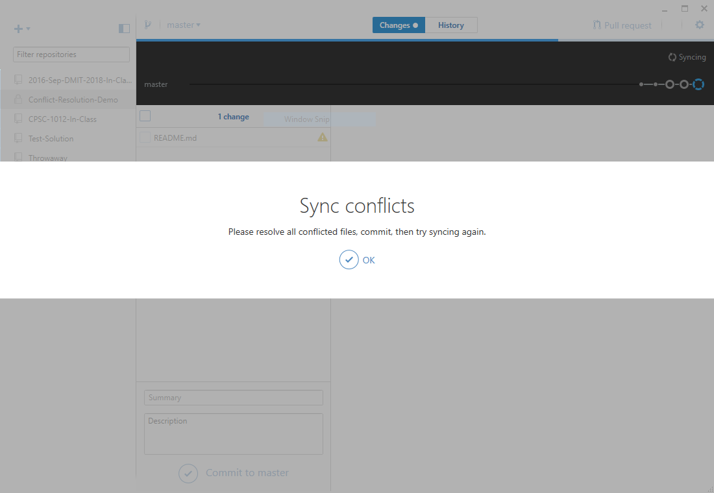

# Demo Instructions

## Setup

Follow these steps to prepare for the demo. You will need a browser, GitHub Desktop and a text editor in order to complete this demo.

1. [Fork](https://github.com/DMIT-2018/Conflict-Resolution-Demo#fork-destination-box) the repository by clicking on the link in these instructions or by clicking the **Fork** button in the [Conflict Resolution Demo](https://github.com/DMIT-2018/Conflict-Resolution-Demo) repository on GitHub.
2. In your fork, click the **Clone or download** button and select **_Open in Desktop_** to clone your fork onto your computer.
3. Add a new text file on your computer named `TODO.md` and copy the contents of this *Demo.md* file into the *TODO.md*. Then commit the changes and sync with your fork. If everything goes well, this will ensure that you've got the correct clone on your local computer. If not, then you will need to delete the clone on your computer and go back to step 2.

## Creating potential conflicts

- [ ] In your browser on the GitHub page for your clone of this repository, click the **Create New File** button. Give the file the name `Recipe.txt` and paste in the following text. Then click the **Commit Changs** button in your browser.

```
Kraft Dinner Recipe
1. Bring water to boil in medium saucepan. Add Macaroni; cook 7 to 8 min. or until tender, stirring occasionally.
2. Drain. (Do not rinse.) Return macaroni to pan.
2. Add margarine, milk and Cheese Sauce Mix; mix well.

Credits: http://www.kraftrecipes.com/recipes/kraft-macaroni-cheese-dinner-56248.aspx
```

- [ ] On your computer, create a new text file of the same name as the previous one (`Recipe.txt`) with the following text. Commit the changes on your computer. Note that there is a subtle change in the text between the two files.

```
Kraft Dinner Recipe
1. Boil in medium saucepan. Add Macaroni; cook 7 to 8 min. or until tender, stirring occasionally.
2. Drain. (Do not rinse.) Return macaroni to pan.
2. Add margarine, milk and Cheese Sauce Mix; mix well.

Credits: http://www.kraftrecipes.com/recipes/kraft-macaroni-cheese-dinner-56248.aspx
```

- [ ] Click the sync button. You should have a merge conflict.
  - 
- [ ] Click OK on the Sync conflicts and then open the Git Shell through the gear icon on GitHub Desktop.
- [ ] You can inspect the status of the repository by typing in `git status`. It should state something to the effect that *Your branch and 'origin/master' have diverged*.
- [ ] Type `git mergetool -t bc4` to open Beyond Compare 4 to solve the merge issue. It should open the Beyond Compare program as shown in the following image. (If it does not open, then you will need to re-check your .gitconfig settings, as shown in the ReadMe.md file on this site.)
  - 
- [ ] Select either the local change (left pane) or the remote change (right pane) for the line with the conflict. Note that the middle pane is blank - that is because this file did not exist in the shared history of the local and remote clones. The changes you have chosen are in the bottom pane.
- [ ] When you have selected your change, close Beyond Compare and click **Yes** to the dialog asking you to "Save merged output".
- [ ] In the git shell, type `git status` and you will see in the message "All conflicts are fixed but you are still merging." To complete the merge, type `git commit -m "Fixed merge conflict"`.
- [ ] You should now be able to close the git shell and click the **Sync** button in GitHub Desktop.
