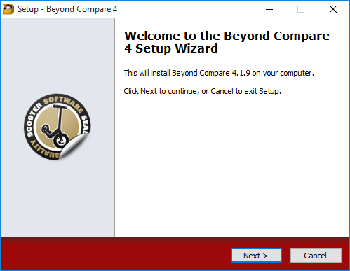
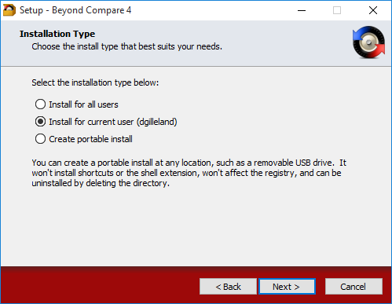
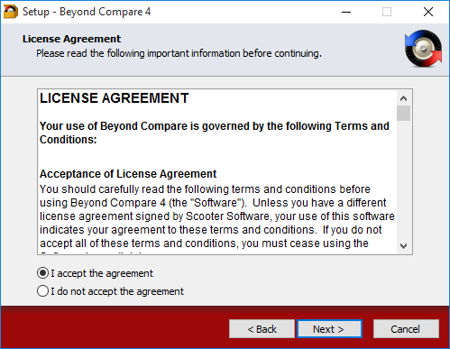
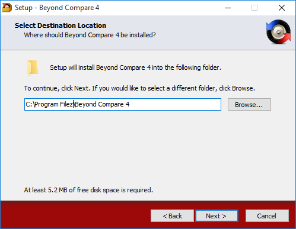
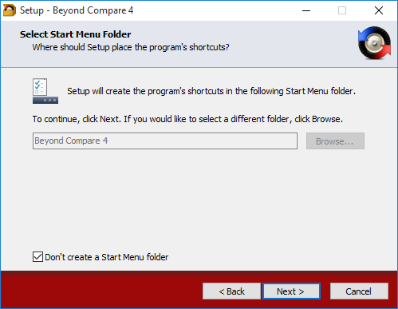
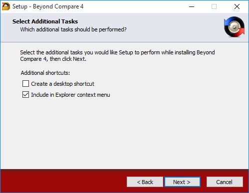
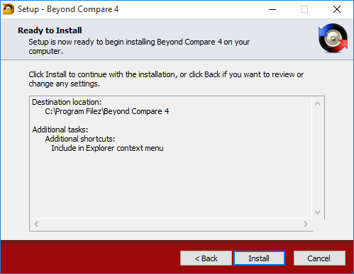
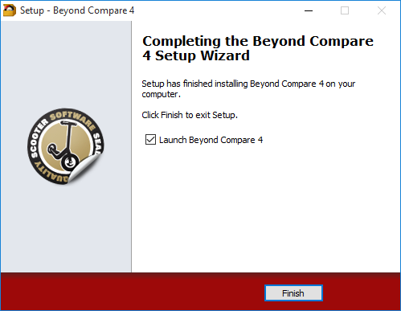
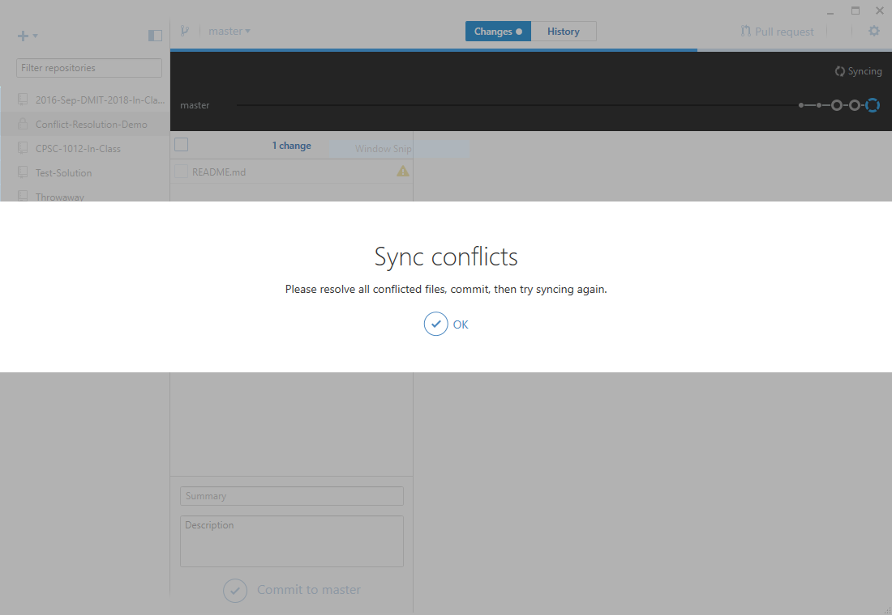

# Conflict-Resolution-Demo

This demonstrates resolving merge conflicts through the git shell and the use of a merge tool.

## Install Beyond Compare as the Merge Tool

**[Beyond Compare](http://www.scootersoftware.com/index.php)** is a commercial program that performs folder and file comparisons. From the website, they state that you can use it to:

> Compare files and folders using simple, powerful commands that focus on the differences you're interested in and ignore those you're not.  Merge changes, synchronize files, and generate reports.

- **Step 1:** [Download](http://www.scootersoftware.com/BCompare-4.1.9.21719.exe) Beyond Compare from the link here or from their website.
- **Step 2:** Run the install to install in our labs. Because you do not have administer rights to install software on the lab computers, you will need to use the following guide for the installation.
  - **2.1** - Click *Next* on the welcome dialog.
    - 
  - **2.2** - Select the option to install for the **current user** only and click *Next*.
    - 
  - **2.3** - Agree to the terms and click *Next*.
    - 
  - **2.4** - Make sure the installation path is set to **`c:\Program Filez\Beyond Compare 4`** (*note the `z` that replaces the `s` in "Program Files"*) and then click *Next*.
    - 
  - **2.5** - Select the checkbox that days "Don't create a Start Menu folder" and then click *Next*.
    - 
  - **2.6** - Make sure only the "Include in Explorer context menu" checkbox is selected and then click *Next*.
    - 
  - **2.7** - Review the installation options and then click *Next*.
    - 
  - **2.8** - You do not have to start Beyond Compare unless you want to see what it's like. Click *Finish* to finalize the setup.
    - 
- **Step 3:** Follow the [instructions to set up Beyond Compare for GitHub for Windows](http://www.scootersoftware.com/support.php?zz=kb_vcs#githubwindows) to use Beyond Compare as the diff and merge tools in GitHub Desktop.
  - **3.1** - Note that you will need to ensure the cmd path is the same as the one you used to install Beyond Compare in the labs. You will also need to close and re-start GitHub Desktop.
 
## Resolving Conflicts

You will know when a merge conflict occurs, because when you attempt to sync, GitHub Desktop will tell you that about the conflicts.

Use the following steps to fix the problem:

- **Step 1:** Click OK in GitHub Desktop.
- **Step 2:** Open the git shell and use the following commands to diagnose the situation.
  - `git status` to view the status of the repository
  - `git mergetool -t bc4` to run the mergetool to resolve the conflicts

### Tools

Different merge tools are available, such as **kdiff3** and **Beyond Compare**.

